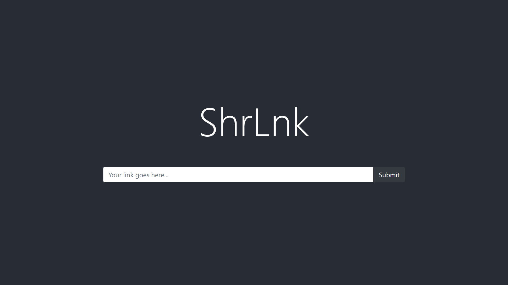

# ShrLnk

A simple MERN-based link shortener. You can check out a demo [here](https://shrlnk.herokuapp.com/).



## Getting Started

- Install dependencies 
```
npm install
```

- Start the react app
```
npm run fend-start
```

- Start the node.js LnkShrtnr server
```
npm start
```

## Endpoints

- ### POST `/api/`
  - **body** `{ "link": [enter your link here] }`
  - Takes any link and produces a corresponding shortened link.

- ### GET `/api/:link`
  - Takes a shortened link token and returns the original link.
